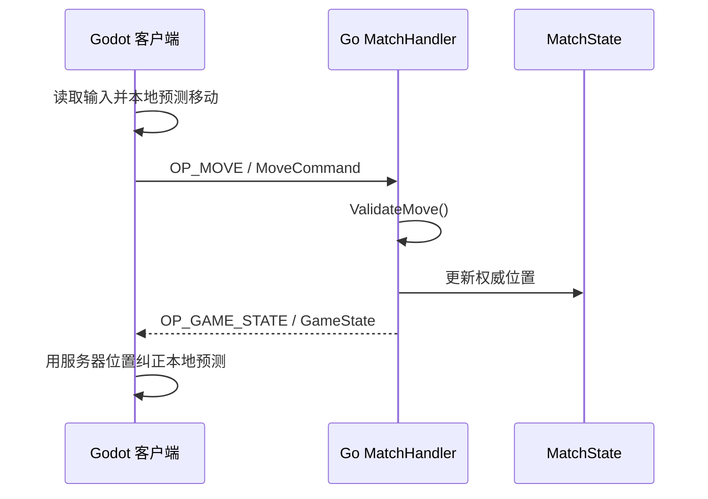
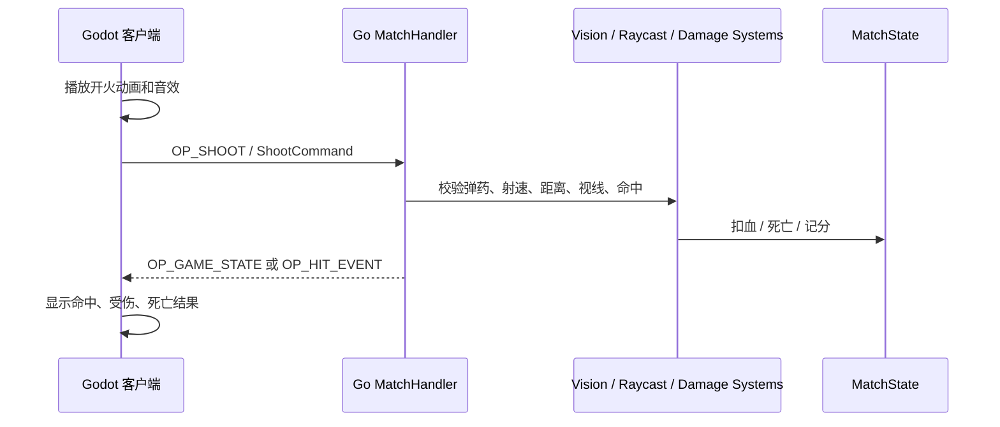

# 联机架构与权威判定说明

这份文档给项目组同学说明：联机模式下前端、后端分别负责什么，现有框架如何流转数据，以及后续加入视野、远程服务器射击、命中、死亡判定时应该放在哪一层实现。

## 一句话原则

**客户端负责表现和输入，服务器负责真相和裁决。**

客户端可以为了手感先做本地预测，例如玩家按下移动键后马上在本机移动；但最终位置、血量、死亡、击杀、胜负、炸弹状态都必须以服务器广播的权威状态为准。

## 当前项目的联机框架

当前联机链路由 Godot 客户端、Nakama Socket、Go authoritative match 三部分组成：

```mermaid
flowchart LR
    A["Godot 客户端\nclient/scripts/main_game"] -->|登录 / 匹配 / 加入比赛| B["Nakama"]
    A -->|send_match_state\nMoveCommand 等玩家指令| C["Go MatchHandler\nserver/modules/match_handler.go"]
    C -->|每 tick 校验和更新| D["MatchState\nserver/modules/state"]
    C -->|调用 systems\nmovement / damage / round / future vision"] E["服务器系统逻辑\nserver/modules/systems"]
    C -->|BroadcastMessage\nGameState 权威快照| A
```

关键文件：

- `client/scripts/main_game/network_client.gd`：登录、Socket 连接、匹配、发送玩家输入、接收服务器状态。
- `client/scripts/main_game/main.gd`：本地输入、本地预测、渲染玩家、应用服务器权威状态。
- `client/scripts/main_game/protobuf_codec.gd`：客户端 protobuf 编解码。
- `server/modules/match_handler.go`：Nakama authoritative match 入口，处理加入、离开、每 tick 消息、广播状态。
- `server/modules/state/`：服务器保存的真实比赛状态。
- `server/modules/systems/`：服务器系统逻辑，例如移动校验、伤害、回合计时。
- `server/modules/config/`：所有可调参数，例如速度、血量、视野、武器伤害、tick rate。
- `server/modules/protobuf/messages.proto`：前后端实时消息格式。

## 当前已经实现的流程

### 1. 登录和匹配

客户端在 `NetworkClient.login()` 中使用 Nakama 邮箱登录，然后创建 Socket。

客户端调用 `start_matchmaking()` 进入 Nakama matchmaker。匹配成功后，客户端通过 `join_matched_async()` 加入服务器创建的 authoritative match。

服务端在 `InitModule()` 注册：

- match handler：`config.MATCH_MODULE_NAME`
- RPC：`create_breach_match`
- matchmaker matched hook：匹配成功后创建 match

### 2. 客户端发送移动

`main.gd` 在 `_physics_process()` 中读取输入：

```gdscript
var direction := Input.get_vector("left", "right", "up", "down")
var predicted_position := local_position + direction * Config.PLAYER_MOVE_SPEED * delta
```

如果本地简单碰撞检测通过，客户端先更新自己的 `local_position`，再调用：

```gdscript
network.send_move(client_tick, local_position, direction)
```

这个消息会被编码成 `MoveCommand`，用 `OP_MOVE = 1` 发给服务器。

### 3. 服务器校验移动

服务器 `MatchLoop()` 每 tick 收到客户端消息后，根据 op code 分发：

```go
case OpCodeMove:
    processMove(logger, dispatcher, current, message, tickInterval)
```

`processMove()` 做几件事：

1. 找到发消息的玩家。
2. 反序列化 `MoveCommand`。
3. 检查协议版本和字段。
4. 调用 `systems.ValidateMove()`。
5. 校验通过才更新服务器里的 `player.Position` 和 `player.LastValid`。

`ValidateMove()` 会检查：

- 是否越界。
- 是否撞到障碍物。
- 每 tick 移动距离是否超过 `config.PLAYER_MAX_SPEED` 允许的范围。

如果速度超限，服务器会记录作弊警告，并尝试把玩家踢出比赛。

### 4. 服务器广播权威状态

每个服务器 tick，`broadcastGameState()` 会把当前 `MatchState` 转成 `GameState` protobuf，然后调用：

```go
dispatcher.BroadcastMessage(OpCodeGameState, data, current.ActivePresences(), nil, true)
```

客户端收到 `OP_GAME_STATE = 2` 后解码，并触发：

```gdscript
authoritative_state_received.emit(ProtobufCodec.decode_game_state(match_state.binary_data))
```

`main.gd` 的 `_on_authoritative_state()` 会把服务器玩家列表写回本地。如果某个玩家是自己，也会用服务器位置覆盖本地预测位置：

```gdscript
if player["user_id"] == my_user_id:
    local_position = player["position"]
```

这就是当前的基础同步模式：**客户端预测，服务器纠正。**

## 前后端职责边界

### 客户端应该做什么

客户端负责让玩家操作感觉顺滑：

- 读取键盘、鼠标、手柄输入。
- 做本地预测，例如移动、开火动画、枪口火光、音效、准星反馈。
- 发送“玩家意图”给服务器，例如移动方向、瞄准方向、开火请求、换弹请求、放置炸弹请求。
- 接收服务器状态，并把场景表现同步到权威结果。
- 可以做本地辅助检测，但只用于体验，不能作为最终判定。

客户端不应该决定：

- 我是否真的命中了敌人。
- 敌人是否死亡。
- 我是否成功种包或拆包。
- 我能否看见某个敌人。
- 我是否真的拿到了分数和升级。

### 服务器应该做什么

服务器负责比赛真相：

- 保存所有玩家的真实位置、朝向、血量、武器、弹药、阵营、存活状态。
- 在固定 tick rate 下处理所有输入。
- 校验移动速度、碰撞、开火频率、弹药、距离、视线、命中。
- 计算伤害、死亡、击杀、分数、回合胜负。
- 广播权威状态给客户端。
- 对可疑行为记录日志、拒绝请求，必要时踢出比赛。

## 后续加入视野机制时怎么做

视野机制应该分成两层：

1. **服务器视野判定**：决定某个玩家理论上能看见谁。这是权威逻辑。
2. **客户端视野表现**：画黑雾、圆形视野、扇形视野、阴影。这是视觉表现。

建议新增：

- `server/modules/systems/vision.go`
- `server/modules/systems/vision_test.go`
- 在 `state.Player` 中保存朝向，例如 `Facing state.Vec2`
- 在 protobuf 的 `MoveCommand` 或新增 `AimCommand` 中同步玩家朝向
- 在 `GameState` 或后续的 per-player snapshot 中包含可见对象

服务器视野判定需要使用配置：

- `config.PLAYER_VISION_RADIUS`
- `config.PLAYER_VISION_CONE`
- `config.SOLID_OBSTACLES`

服务器判定流程建议：

1. 对每个玩家读取位置和朝向。
2. 圆形近距离范围内的目标可见。
3. 扇形远距离范围内，角度满足才可能可见。
4. 从观察者到目标做线段与障碍物相交检测。
5. 没被障碍挡住才算可见。

早期可以先让服务器广播所有玩家，由客户端自己画视野；等玩法进入对抗测试后，再改成服务器按玩家分别发送可见目标，避免客户端拿到不该知道的敌人位置。

## 后续加入射击、命中、死亡判定时怎么做

射击一定要由服务器判定。客户端只发送“我想开枪”，不要发送“我打中了谁”。

建议新增 op code：

- `OP_SHOOT = 3`
- `OP_RELOAD = 4`
- `OP_ABILITY = 5`

建议在 `messages.proto` 中新增：

```proto
message ShootCommand {
  uint32 version = 1;
  uint64 client_tick = 2;
  Vector2 origin = 3;
  Vector2 direction = 4;
  uint32 weapon_slot = 5;
}

message HitEvent {
  string shooter_id = 1;
  string target_id = 2;
  int32 damage = 3;
  bool killed = 4;
}
```

服务器收到 `ShootCommand` 后按以下顺序校验：

1. 玩家存在、已连接、活着。
2. 武器已装备，有弹药。
3. 开火间隔满足 `config.DEFAULT_SIDEARM_FIRE_RATE` 等配置。
4. `origin` 不能离服务器记录的玩家位置太远。
5. `direction` 是合法单位向量。
6. 射线距离不超过武器射程。
7. 射线被障碍物挡住时，在障碍后面的目标不能命中。
8. 根据玩家碰撞半径或 hitbox 做射线命中检测。
9. 命中后调用 `systems.ApplyDamage()`。
10. 血量归零时，服务器设置死亡状态、记录击杀、广播死亡事件。

客户端开火时可以立即播放动画和音效，但命中提示、伤害数字、死亡表现应该等服务器确认，或者先显示轻量预测反馈，收到服务器结果后再修正。

## 推荐的数据流

### 移动



### 射击



## 实现建议顺序

为了降低联机复杂度，建议按这个顺序推进：

1. **补齐玩家朝向同步**  
   先让 `MoveCommand.direction` 或新的 aim 字段真正写入 `state.Player`。

2. **实现服务器射线工具**  
   在 `systems` 中写通用线段检测：射线与圆形玩家、射线与矩形障碍物。

3. **实现服务器射击命令**  
   新增 `ShootCommand`、`OpCodeShoot`、弹药和开火冷却。先只做默认手枪。

4. **实现伤害和死亡状态**  
   扩展 `state.Player`，加入 `Alive`、`LastShotAt`、`Ammo` 等字段。血量归零后服务器广播死亡。

5. **实现服务器视野判定**  
   先只做“能否看见目标”的函数和单元测试，再接入广播过滤。

6. **实现客户端表现**  
   最后再补枪口火光、命中反馈、黑雾、扇形视野等视觉效果。

## 编码约定

新增玩法时尽量遵守这些约定：

- 所有可调参数放进 `server/modules/config/`，不要在逻辑中硬编码。
- 所有实时消息先改 `server/modules/protobuf/messages.proto`，再同步更新 Go/Godot 编解码。
- `MatchLoop()` 只做调度，复杂逻辑放进 `server/modules/systems/`。
- 服务器收到客户端消息时，默认不信任，必须校验。
- 关键广播使用 reliable。
- Go 代码修改后运行：

```bash
gofmt -w ./server/
go vet ./server/modules/...
```

## 当前项目的状态总结

目前项目已经具备权威服务器的基础骨架：

- 已有 Nakama 登录、Socket、匹配和 authoritative match。
- 已有移动指令 `MoveCommand`。
- 已有服务器移动校验。
- 已有 `GameState` 权威快照广播。
- 已有基础回合计时、玩家状态、伤害函数。

接下来最重要的不是先做复杂特效，而是把“输入命令 -> 服务器校验 -> 修改 MatchState -> 广播权威结果”这条链路继续扩展到视野、射击、命中和死亡。只要这条边界守住，后续客户端表现可以逐步变丰富，联机逻辑也不会散。
